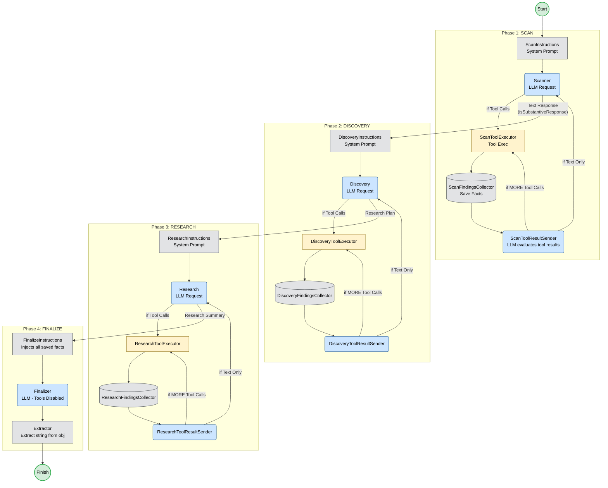

# Стратегия автономного поиска (Koog Autoresearch Strategy)

Этот документ описывает архитектуру автономного ИИ-агента для генеалогического поиска, реализованного с использованием графовой стратегии библиотеки Koog 1.0.

Решение построено на основе графа (State Machine), который проходит через четыре последовательные фазы. Это позволяет жестко контролировать процесс поиска и избежать рандомного блуждания LLM по инструментам.

## Блок-схема графа состояний

Схема ниже визуализирует последовательность нод и переходов.

### Описание фаз:

1. **Phase 1: SCAN**  
   Агент анализирует предоставленное дерево, выявляет регионы и запрашивает списки доступных архивных гайдов. Строго запрещено использовать основные поисковые инструменты на этой фазе.
2. **Phase 2: DISCOVERY**  
   Агент читает необходимые Markdown-руководства, собранные в фазе SCAN, изучает методологию и составляет подробный пошаговый план поиска.
3. **Phase 3: RESEARCH**  
   Основной процесс поиска. Агент использует инструменты взаимодействия с базами (например, Pamyat Naroda, FamilySearch), опираясь на выработанный план. Инструменты могут вызываться рекурсивно до тех пор, пока поиск не будет завершён.
4. **Phase 4: FINALIZE**  
   Агент собирает все факты (перехваченные и сохранённые специальными нодами `FindingsCollector` на предыдущих этапах) и формирует финальный сводный отчёт. Инструменты в этой фазе жестко отключены.
