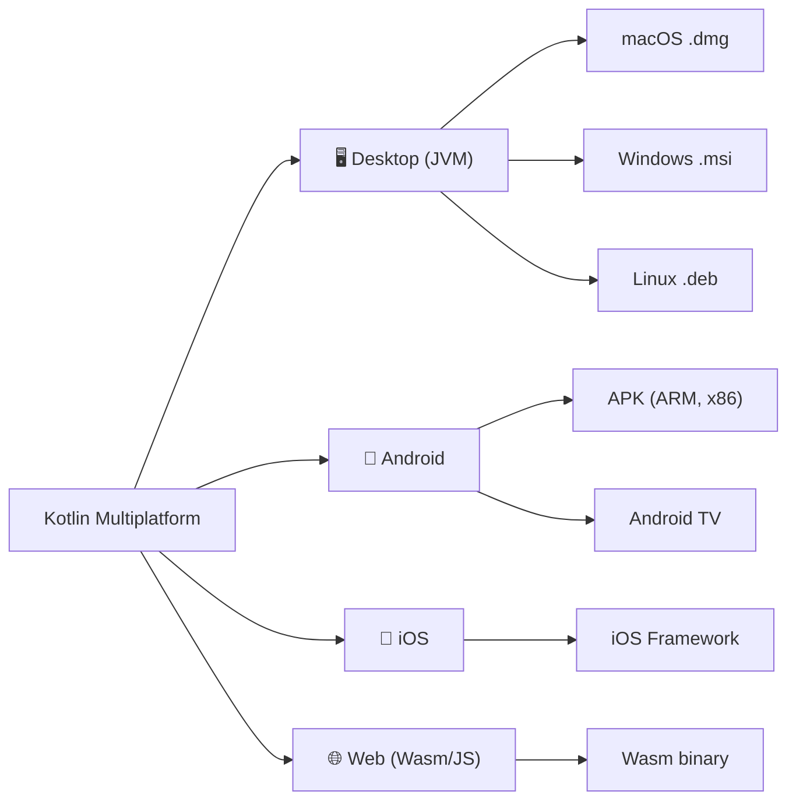
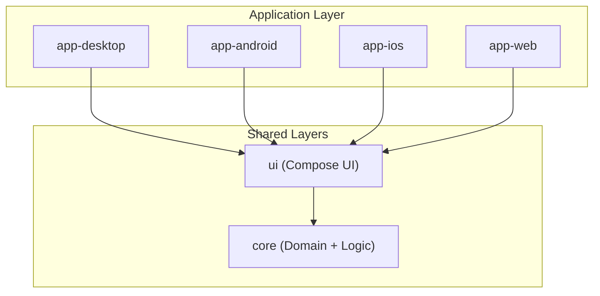
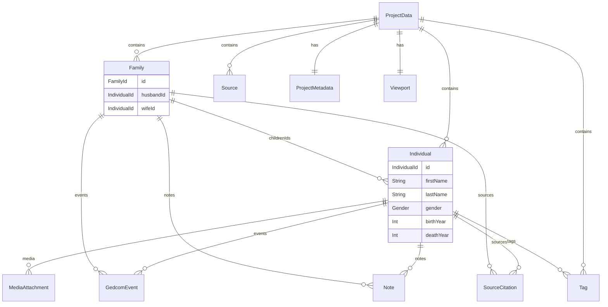
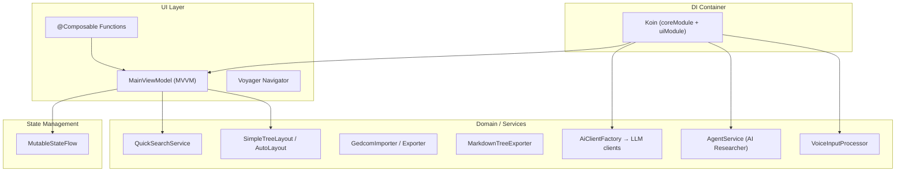
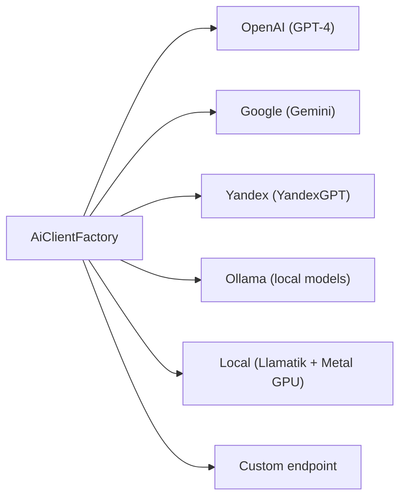

# Family Tree Editor — Technical Implementation

> A cross-platform family tree editor built on **Kotlin Multiplatform** and **Compose Multiplatform**.
> Version: **2.1.4** · ~192 Kotlin files · ~27,300 lines of code

---

## 1. Technology Stack

| Component | Technology | Version |
|---|---|---|
| Language | Kotlin Multiplatform | 2.4.0 |
| UI Framework | Compose Multiplatform | 1.11.1 |
| JDK | OpenJDK | 25 |
| Build System | Gradle (Kotlin DSL) | 9.5.1 |
| Android Gradle Plugin | AGP | 9.2.1 |
| Network Client | Ktor | 3.5.0 |
| Serialization | kotlinx.serialization | 1.11.0 |
| File I/O | Okio | 3.17.0 |
| DI | Koin | 4.2.1 |
| Navigation | Voyager | 1.1.0-beta03 |
| Lifecycle/ViewModel | Jetbrains Lifecycle | 2.10.0 |
| AI Agent | Koog Agents | 1.0.0 |
| Local AI | Llamatik (Metal GPU) | 1.7.2 |
| Voice Input | Vosk (offline STT) | 0.3.38 / 0.3.75 |

---

## 2. Target Platforms



| Platform | Module | HTTP Engine | Specifics |
|---|---|---|---|
| Desktop (macOS, Linux, Windows) | `app-desktop` | Ktor CIO | ProGuard R8, native distributions via Compose Desktop, MenuBar |
| Android (Phone + TV) | `app-android` | Ktor OkHttp | minSdk 26, targetSdk 37, ProGuard, keystore signing |
| iOS | `app-ios` + `iosApp` (Xcode) | Ktor Darwin | Static framework `FamilyTreeApp`, Xcode project |
| Web | `app-web` | Ktor JS | Kotlin/Wasm, Webpack |

---

## 3. Modular Architecture



### 3.1 `core` Module — Domain Logic

A pure-Kotlin module with **no UI dependencies**. Source sets: `commonMain`, `androidMain`, `desktopMain`, `iosMain`, `wasmJsMain`.

| Package | Responsibility | Key Files |
|---|---|---|
| `model` | Domain data models | `Individual.kt`, `Family.kt`, `Id.kt`, `GedcomEvent.kt`, `Source.kt`, `SourceCitation.kt`, `Note.kt`, `MediaAttachment.kt`, `Tag.kt` |
| `io` | Project serialization / deserialization | `ProjectDto.kt`, `RelImporter.kt` (38 kB — .rel format parser), `ProjectJson.kt` |
| `gedcom` | GEDCOM 5.5.5 import / export | `GedcomImporter.kt` (17 kB), `GedcomExporter.kt` (8.5 kB), `GedcomMapper.kt` |
| `layout` | Tree auto-layout algorithm | `AutoLayout.kt` (30 kB), `SimpleTreeLayout.kt` |
| `ai` | AI clients for LLM and STT | `OpenAiClient.kt`, `GoogleClient.kt`, `YandexClient.kt`, `OllamaClient.kt`, `LocalAiClient.kt` (Llamatik), `CustomClient.kt`, `AiTextImporter.kt` (20 kB) |
| `ai.agent` | Autonomous AI agent (genealogy researcher) | `AgentService.kt` (30 kB), `GenealogyTools.kt` (57 kB — the largest file in the project), `AutoresearchStrategy.kt` (20 kB), `TavilyClient.kt` |
| `ai.koog` | Adapter for the Koog AI framework | `KoogModelAdapter.kt` |
| `genealogy` | Integration with genealogical APIs | `FamilySearchClient.kt`, `GenealogyApiService.kt`, `GenealogyApiConfig.kt` |
| `export` | Tree export | `MarkdownTreeExporter.kt` |
| `search` | Quick search across the tree | `QuickSearchService.kt` |
| `platform` | Platform abstractions (expect/actual) | `FileGateway.kt`, `PdfTextExtractor.kt`, `ResourceLoader.kt`, `VoiceRecorder.kt` |
| `di` | Koin DI configuration | `Koin.kt` |
| `geometry` | 2D math | `Vec2.kt` |
| `sample` | Demo data | `SampleData.kt` |
| `render` | Rendering metrics | `NodeMetrics.kt` |

### 3.2 `ui` Module — Compose UI

A shared UI layer built on **Compose Multiplatform + Material 3**. Uses **Voyager** for navigation and **Koin Compose** for DI.

| Component | Responsibility | Size |
|---|---|---|
| `MainScreen.kt` | Main application screen with canvas | 25 kB |
| `TreeRenderer.kt` | Canvas-based tree rendering (pan/zoom) | 59 kB |
| `PropertiesInspector.kt` | Properties inspector (right panel) | 45 kB |
| `AiConfigDialog.kt` | AI configuration dialog | 36 kB |
| `MainScreenDialogs.kt` | Dialog management | 31 kB |
| `AutoSearchDialog.kt` | Automatic search dialog | 26 kB |
| `DatePhraseDialog.kt` | Complex date input dialog | 24 kB |
| `MainViewModel.kt` | Central ViewModel (MVVM) | 7 kB |
| Panels: `LeftSidebar.kt`, `RightSidebar.kt` | Side panels | — |

---

## 4. Domain Data Model



All models are annotated with `@Serializable` (kotlinx.serialization) and use **value-class ID wrappers** (`IndividualId`, `FamilyId`) for type safety.

---

## 5. Application Architecture (Runtime)



### State Management

- `MainState` — a single state class: project, layout positions, selection, active dialog
- `MutableStateFlow` + `.update{}` — reactive updates via coroutines
- `viewModelScope` — lifecycle binding to the ViewModel

---

## 6. AI / ML Subsystem

### 6.1 LLM Providers



- **AiTextImporter** (20 kB) — analyzes arbitrary text and extracts people and relationships via LLM
- **Fully offline mode** via **Llamatik** with Metal GPU hardware acceleration
- Configuration is stored in `AiSettingsStorage`, UI — via `AiConfigDialog`

### 6.2 AI Agent (Genealogy Researcher)

An autonomous AI agent for genealogical research, built on **Koog Agents** (1.0.0):

- `AgentService.kt` — agent orchestration
- `GenealogyTools.kt` (57 kB) — agent tool set (function-calling): FamilySearch queries, record analysis, profile matching
- `AutoresearchStrategy.kt` — strategy for automatic tree expansion
- Integration with **FamilySearch API** via `FamilySearchClient.kt`
- Web search via **Tavily API**

### 6.3 Voice Input (STT)

| Engine | Platforms | Mode |
|---|---|---|
| **Vosk** | Desktop (JVM), Android | Offline |
| **OpenAI Whisper** | All | Online |
| **Google Speech** | All | Online |
| **Yandex Speech** | All | Online |

Architecture: `VoiceRecorder` (expect/actual) → `TranscriptionClientFactory` → `VoiceInputProcessor`

---

## 7. Supported Formats

| Format | Import | Export | Description |
|---|---|---|---|
| **JSON (.json)** | ✅ | ✅ | Native format (ProjectDto ↔ ProjectData) |
| **GEDCOM 5.5.5** | ✅ | ✅ | Standard genealogical format |
| **.rel** | ✅ | — | Legacy format from the JavaFX version (38 kB parser) |
| **Markdown** | — | ✅ | Human-readable tree export |
| **Text (AI)** | ✅ | — | Arbitrary text → AI analysis → tree |
| **PDF** | ✅ | — | Text extraction (platform-specific) |
| **Voice** | ✅ | — | Audio → STT → AI → tree |

---

## 8. Tree Rendering Engine

`TreeRenderer.kt` (59 kB) — the largest UI file:

- **Canvas-based rendering** with hardware acceleration via Compose Canvas API
- **Pan & Zoom** — viewport transformations (gestures + mouse wheel)
- **Interactive selection** — clicking on nodes/edges, highlighting
- **Drag & Drop** — dragging persons on the canvas
- **Add/Delete** directly on the canvas (context menu)
- Layout algorithm: `SimpleTreeLayout` (fast) and `AutoLayout` (30 kB — advanced with multi-generation alignment)

---

## 9. Dependency Injection (Koin)

```
initKoin()
 ├── coreModule
 │    ├── QuickSearchService (singleton)
 │    ├── AiSettingsStorage (singleton)
 │    ├── MarkdownTreeExporter (singleton)
 │    ├── AI Clients: OpenAI, Google, Yandex, Ollama, Custom, Local (singletons)
 │    ├── LocalModelManager (singleton)
 │    ├── AiClientFactory (singleton)
 │    ├── Transcription: Whisper, GoogleSpeech, YandexSpeech (singletons)
 │    ├── AgentService (singleton)
 │    ├── TavilyClient (singleton)
 │    ├── Json (singleton, lenient, coerceInputValues)
 │    ├── HttpClient (singleton, 120s timeout)
 │    ├── VoiceInputProcessor (factory, scoped)
 │    └── AiTextImporter (factory, scoped)
 └── uiModule
      └── MainViewModel (viewModel factory)
```

---

## 10. CI/CD

| Workflow | File | Description |
|---|---|---|
| **CI** | `ci.yml` (5.8 kB) | Build and validation on push/PR |
| **Release** | `release.yml` (7.5 kB) | Automated release: Desktop (macOS/Linux/Windows), Android APK |

Local release: script `release_app.sh` — bump version → commit → tag → push.

---

## 11. Source Set Structure (expect/actual)

```
core/src/
├── commonMain/       ← Shared logic, models, AI clients
├── androidMain/      ← Ktor OkHttp, Security Crypto, PDF (PdfBox), Vosk Android
├── desktopMain/      ← Ktor CIO, Vosk JVM, JNA
├── iosMain/          ← Ktor Darwin
└── wasmJsMain/       ← Ktor JS

ui/src/
├── commonMain/       ← Compose UI, ViewModel, Navigator
├── androidMain/      ← Activity Compose, resources
├── desktopMain/      ← Desktop Compose (currentOs)
├── iosMain/          ← iOS-specific adaptations
└── wasmJsMain/       ← Wasm-specific adaptations
```

---

## 12. Key Architectural Decisions

1. **Clean Architecture**: `core` (domain) → `ui` (presentation) → `app-*` (entry points) — strict unidirectional dependency
2. **MVVM + StateFlow**: A single `MainViewModel` with a `MainState` data class, updated via `StateFlow.update{}`
3. **Value-class IDs**: `IndividualId`, `FamilyId` — preventing type confusion at compile time
4. **DTO Layer**: A separate `ProjectDto` for serialization, with `toDomain()` / `fromDomain()` mapping
5. **Platform Abstraction**: `expect/actual` for file operations, voice input, PDF
6. **AI Plugin Architecture**: `AiClientFactory` with pluggable providers, a unified `BaseAiClient` interface
7. **Gradle Version Catalog**: All dependencies are centralized in `libs.versions.toml`
8. **BuildConfig Generation**: The application version is injected into code via the Gradle task `generateBuildConfig`

---

## 13. Project Metrics

| Metric | Value |
|---|---|
| Kotlin files (src) | **192** |
| Lines of code (Kotlin) | **~27,300** |
| Gradle modules | **6** (core, ui, app-desktop, app-android, app-ios, app-web) |
| Target platforms | **4** (Desktop, Android, iOS, Web) |
| Distribution formats | **7** (DMG, MSI, DEB, AppImage, APK, iOS Framework, Wasm) |
| LLM AI providers | **6** (OpenAI, Google, Yandex, Ollama, Local/Llamatik, Custom) |
| STT engines | **4** (Vosk, Whisper, Google Speech, Yandex Speech) |
| Releases | **70+** (since August 2025) |
